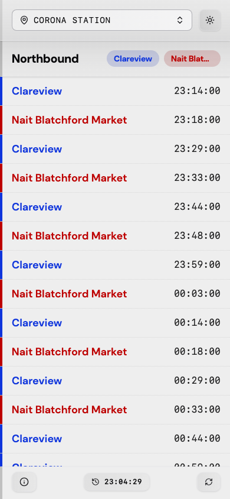

# Headway

A mobile-first PWA that finds your nearest Edmonton LRT station and shows upcoming departures.

**Live at [headway.andy.ws](https://headway.andy.ws)** (also at [next-departures.fly.dev](https://next-departures.fly.dev)).

## What it is

I wanted a faster way to answer "when's my next train?" than opening a transit app and tapping through menus. Headway uses your location to pick the closest LRT station, then shows the upcoming departures in both directions, computed from the official ETS GTFS schedule data.

It works best installed as a PWA on a phone (on iOS: Safari → Share → Add to Home Screen), but it's a normal web app and runs fine in any browser. If geolocation fails or is denied, it falls back to a default location, and you can always pick a station manually.



## How it works

- **Client**: React 19 + Vite 6, Tailwind CSS 4, with Radix UI / vaul for the dialog and drawer components. `vite-plugin-pwa` handles the service worker, manifest, and offline fallback.
- **Server**: A small [Hono](https://hono.dev) server (Node 20) that serves the built client and exposes a JSON API for stations and departures.
- **Data**: ETS GTFS schedule data, imported into SQLite with [node-gtfs](https://github.com/BlinkTagInc/node-gtfs) and then slimmed down to an LRT-only database (~a few MB) that's queried directly with `better-sqlite3`. The server opens the database once at startup and reuses the connection.
- **Hosting**: Fly.io, with Sentry for error reporting and Umami for privacy-friendly analytics (proxied through `/stats.js`).

The slim LRT-only database is checked into the repo at `data/gtfs_lrt_only.db`, so the app runs out of the box without importing anything.

## Getting started

```bash
npm install
npm run dev
```

That starts the Hono API server (port 3000) and the Vite dev server (port 5173) together; open http://localhost:5173.

Other useful scripts:

```bash
npm run build     # build client and server into dist/
npm run preview   # build, then run the compiled server locally
npm run deploy    # build locally, then fly deploy
```

### Updating the GTFS data

A GitHub Actions workflow refreshes the schedule data every Monday: it rebuilds the slim database, commits it if it changed, and deploys. To refresh manually instead:

```bash
npm run db:update
```

That downloads the latest ETS GTFS feed and imports it into `db/gtfs.db` (`db:import`), then runs a SQL script to produce the slim LRT-only database at `data/gtfs_lrt_only.db` (`db:slim`). It takes a minute or two. Both steps read their config from `import-config.json` and `app-config.json`, which are checked in and already point at the ETS feed.

### Testing geolocation

To fake your location in Firefox, set these in `about:config`:

```
geo.provider.testing        → true
geo.provider.network.url    → data:application/json,{"location": {"lat": 53.50584, "lng": -113.52845}, "accuracy": 27000.0}
```

## Testing

Vitest with jsdom, covering the time/stop utility logic, the API route handlers, the server bootstrap, the app controller hook, and the React components.

```bash
npm run test            # watch mode
npm run test:coverage   # single run with coverage
```

As of July 2026: **102 tests across 20 files, all passing**, with **92.1% statement coverage** (87.5% branches, 96.2% functions).

## Deployment

Deployed to Fly.io. Pushes to `main` deploy automatically via GitHub Actions (the workflow builds the client and server, then runs `flyctl deploy`). To deploy from a local checkout instead:

```bash
npm run db:update   # optional: refresh schedule data
npm run deploy      # npm run build && fly deploy
```

The custom domain (`headway.andy.ws`) is a CNAME to Fly.io with an auto-renewing Let's Encrypt certificate.
